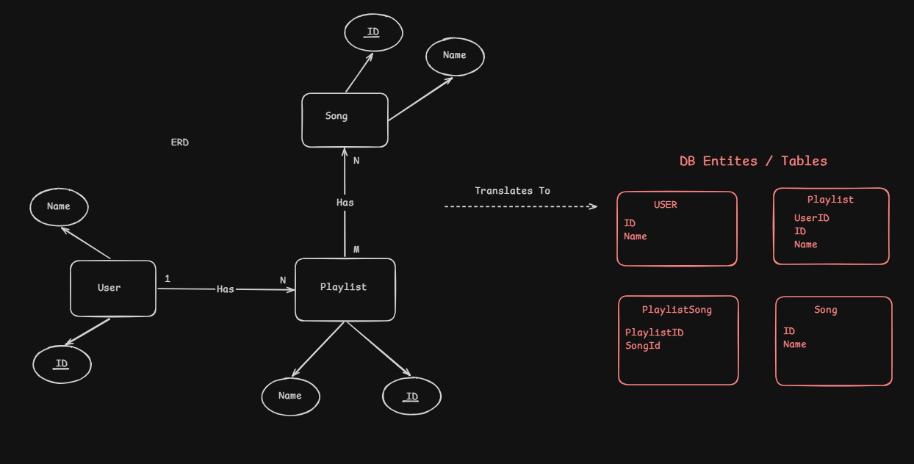

# Playlist API

A RESTful backend API for creating playlists, adding songs to playlists, and retrieving a user's playlists and songs.

The project is implemented using **Java 21**, **Spring Boot**, **Spring Data JPA**, and **PostgreSQL**, and can be run locally using **Docker Compose** with minimal setup.

> **Important:** Every API endpoint requires the `X-User-Id` HTTP header. \
> For this exercise, the header is used as a lightweight way of identifying the current user. \
It is **not intended to represent production authentication or authorization**.\
Usually this information comes from the **JWT TOKEN**

Checkout this section: [User Identification](#user-identification)

For fast API testing checkout: 
- [Testing the Complete API Flow with Postman](#testing-the-complete-api-flow-with-postman)
- [Seeded Test Data](#seeded-test-data)
- [Endpoint Summary](#endpoint-summary)

For Deep Dives checkout:
- [Architecture](#architecture)
- [Database Choice](#database-choice)
- [Database Model](#database-model)
- [Concurrency and Data Consistency](#concurrency-and-data-consistency)
- [API Design Notes](#api-design-notes)
- [Validation and Error Handling](#validation-and-error-handling)

---

## Table of Contents
- [Tech Stack](#tech-stack)
- [Features](#features)
- [Getting Started](#getting-started)
    - [Prerequisites](#prerequisites)
- [Running with Docker Compose](#running-with-docker-compose)
    - [1. Clone the repository](#1-clone-the-repository)
    - [2. Build and start the application](#2-build-and-start-the-application)
    - [3. Seed Data](#3-seed-data)
    - [4. Stop the application](#4-stop-the-application)
- [Architecture](#architecture)
- [Database Choice](#database-choice)
    - [Why PostgreSQL?](#why-postgresql)
- [Database Model](#database-model)
    - [`users`](#users)
    - [`songs`](#songs)
    - [`playlists`](#playlists)
    - [`playlist_songs`](#playlist_songs)
- [User Identification](#user-identification)

- [Seeded Test Data](#seeded-test-data)
    - [Users](#users-1)
    - [Songs](#songs-1)
- [API Reference](#api-reference)
    - [Endpoint Summary](#endpoint-summary)
- [Testing the Complete API Flow with Postman](#testing-the-complete-api-flow-with-postman)
    - [Step 1 — Create a Playlist](#step-1--create-a-playlist)
    - [Step 2 — Add a Song to the Playlist](#step-2--add-a-song-to-the-playlist)
    - [Step 3 — Add More Songs](#step-3--add-more-songs)
- [Get the User's Playlists](#get-the-users-playlists)
    - [Pagination](#pagination)
- [Get Songs in a Playlist](#get-songs-in-a-playlist)
- [Ownership Protection](#ownership-protection)
- [Validation and Error Handling](#validation-and-error-handling)
    - [Invalid Playlist Name](#invalid-playlist-name)
    - [Resource Not Found](#resource-not-found)
    - [Duplicate Playlist](#duplicate-playlist)
    - [Duplicate Song](#duplicate-song)
- [Concurrency and Data Consistency](#concurrency-and-data-consistency)
- [Running Locally Without Docker](#running-locally-without-docker)
    - [Requirements](#requirements)
    - [1. Create the database](#1-create-the-database)
    - [2. Run on Linux/macOS](#2-run-on-linuxmacos)
    - [3. Run on Windows](#3-run-on-windows)
- [Quick Postman Test](#quick-postman-test)
- [API Design Notes](#api-design-notes)
- [AI Usage](#ai-usage)

---

## Features

* Create playlists for a user
* Add songs to a playlist
* Retrieve a user's playlists
* Retrieve songs inside a playlist
* Pagination support
* Playlist ownership validation
* Request validation
* Consistent API error responses
* Persistent PostgreSQL storage
* Seeded users and songs for immediate API testing
* Database constraints preventing duplicate playlist names and duplicate songs within the same playlist
* Transactional playlist updates with concurrency protection

---

## Tech Stack

| Technology                  | Usage                                |
| --------------------------- | ------------------------------------ |
| Java 21                     | Application language                 |
| Spring Boot 4               | Application framework                |
| Spring MVC                  | REST API layer                       |
| Spring Data JPA / Hibernate | Persistence layer                    |
| PostgreSQL 17               | Relational database                  |
| Jakarta Validation          | Request validation                   |
| Maven                       | Build and dependency management      |
| Docker                      | Application containerization         |
| Docker Compose              | Application + database orchestration |
| Lombok                      | Reducing Java boilerplate            |

---

# Architecture

The project follows a layered architecture:

```text
HTTP Request
     │
     ▼
Controller
     │
     ▼
Service
     │
     ▼
Repository
     │
     ▼
PostgreSQL
```

The main responsibilities are separated into:

```text
src/main/java/com/pm/playlistapp
│
├── controller/      # REST API endpoints
├── dto/             # Request/response models
├── exception/       # Exception handling
├── mapper/          # Entity → DTO mapping
├── models/          # JPA entities
├── repository/      # Database access
└── service/         # Business logic
```

This keeps HTTP handling, business logic, database access, and response mapping separated.

---

# Database Choice

## Why PostgreSQL?

PostgreSQL was selected because the playlist domain is naturally relational.

The application contains clear relationships between:

* Users
* Playlists
* Songs
* Songs belonging to playlists

A relational database provides several useful guarantees for this model:

* Foreign-key relationships between entities
* Unique constraints
* Transaction support
* Strong consistency
* Efficient querying and pagination
* Database-level concurrency control

PostgreSQL also works well with Spring Data JPA and Hibernate.

---

# Database Model


The application uses four main tables.

### `users`

```text
users
-----
id      UUID PRIMARY KEY
name    VARCHAR NOT NULL
```

A user can own multiple playlists.

---

### `songs`

```text
songs
-----
id       UUID PRIMARY KEY
name     VARCHAR NOT NULL
title    VARCHAR NOT NULL
artist   VARCHAR NOT NULL
album    VARCHAR NOT NULL
genre    VARCHAR NOT NULL
```

Songs are stored independently so that the same song can appear in different playlists.

---

### `playlists`

```text
playlists
---------
id        UUID PRIMARY KEY
name      VARCHAR NOT NULL
user_id   UUID NOT NULL
```

Relationship:

```text
User 1 ─────── N Playlist
```

The combination of:

```text
(user_id, name)
```

is unique.

Therefore, the same user cannot create two playlists with the same name.

Different users may use the same playlist name.

---

### `playlist_songs`

```text
playlist_songs
--------------
id            UUID PRIMARY KEY
playlist_id   UUID NOT NULL
song_id       UUID NOT NULL
position      INTEGER NOT NULL
added_at      TIMESTAMP
```

This is the join entity between playlists and songs.

Relationships:

```text
Playlist 1 ─────── N PlaylistSong N ─────── 1 Song
```

Two important uniqueness constraints are enforced:

```text
(playlist_id, song_id)
```

prevents the same song from being inserted into the same playlist more than once.

```text
(playlist_id, position)
```

ensures two songs cannot occupy the same playlist position.

Songs are returned ordered by their playlist position.

---

# User Identification

> **Important:** Every API endpoint requires the `X-User-Id` HTTP header.

For this exercise, the header is used as a lightweight way of identifying the current user.

It is **not intended to represent production authentication or authorization**.

For example:

```http
X-User-Id: 11111111-1111-1111-1111-111111111111
```

When using Postman:

1. Open the **Headers** tab.
2. Add:

```text
Key:   X-User-Id
Value: 11111111-1111-1111-1111-111111111111
```

Use one of the seeded user IDs listed below.

Playlist ownership is validated using this ID. A user cannot add songs to or retrieve songs from another user's playlist.

---

# Getting Started

The recommended way to run the project is using **Docker Compose**.

Docker Compose runs both:

* the Spring Boot API
* the PostgreSQL database

so PostgreSQL and Java do not need to be configured manually on the host machine.

## Prerequisites

Install:

* [Git](https://git-scm.com/)
* [Docker Desktop](https://www.docker.com/products/docker-desktop/)

Docker Engine with the Docker Compose plugin can also be used on Linux.

---

# Running with Docker Compose

## 1. Clone the repository

HTTPS:

```bash
git clone https://github.com/AnasK239/Playlist.git
```

or SSH:

```bash
git clone git@github.com:AnasK239/Playlist.git
```

Enter the project directory:

```bash
cd Playlist
```

---

## 2. Build and start the application

Run:

```bash
docker compose up --build
```

Docker will:

1. Download PostgreSQL 17 if required.
2. Build the application using Java 21 JDK.
3. Create the application JAR.
4. Run the final application using Java 21 JRE.
5. Start PostgreSQL.
6. Start the Spring Boot application.

On the first run, Docker may need to download the required images.

To run in detached mode:

```bash
docker compose up -d --build
```

The API will be available at:

```text
http://localhost:8080
```

---

## 3. Seed Data

The application automatically initializes sample users and songs using:

```text
src/main/resources/data.sql
```

This makes it possible to test the API immediately without creating users or songs manually.

---

## 4. Stop the application

```bash
docker compose down
```

This removes the containers but **keeps the PostgreSQL volume**, so your playlists remain available the next time the application starts.

To also delete the database volume:

```bash
docker compose down -v
```

Use this when you want to completely reset the database.

---

# Seeded Test Data

## Users

| User          | `X-User-Id`                            |
| ------------- | -------------------------------------- |
| John Doe      | `11111111-1111-1111-1111-111111111111` |
| Jane Smith    | `22222222-1111-1111-1111-111111111111` |
| Alice Johnson | `33333333-1111-1111-1111-111111111111` |
| Bob Williams  | `44444444-1111-1111-1111-111111111111` |
| Charlie Davis | `55555555-1111-1111-1111-111111111111` |

For the examples below, we will use:

```text
John Doe
11111111-1111-1111-1111-111111111111
```

---

## Songs

| Song              | Artist                   | Song ID                                |
| ----------------- | ------------------------ | -------------------------------------- |
| Bohemian Rhapsody | Queen                    | `11111111-2222-2222-2222-222222222222` |
| Blinding Lights   | The Weeknd               | `22222222-2222-2222-2222-222222222222` |
| Shape of You      | Ed Sheeran               | `33333333-2222-2222-2222-222222222222` |
| Take Five         | The Dave Brubeck Quartet | `44444444-2222-2222-2222-222222222222` |
| Enter Sandman     | Metallica                | `55555555-2222-2222-2222-222222222222` |
| Midnight City     | M83                      | `66666666-2222-2222-2222-222222222222` |

---

# API Reference

Base URL:

```text
http://localhost:8080/api/v1/playlists
```

## Endpoint Summary

| Method | Endpoint                                        | Description               |
| ------ | ----------------------------------------------- | ------------------------- |
| `POST` | `/api/v1/playlists`                             | Create a playlist         |
| `POST` | `/api/v1/playlists/{playlistId}/songs/{songId}` | Add a song to a playlist  |
| `GET`  | `/api/v1/playlists`                             | Get the user's playlists  |
| `GET`  | `/api/v1/playlists/{playlistId}/songs`          | Get songs from a playlist |

All endpoints require:

```http
X-User-Id: <user UUID>
```

---

# Testing the Complete API Flow with Postman

The easiest way to understand the API is to follow these steps in order.

---

## Step 1 — Create a Playlist

### Request

```http
POST http://localhost:8080/api/v1/playlists
```

### Headers

In Postman, open the **Headers** tab and add:

```text
X-User-Id    11111111-1111-1111-1111-111111111111
Content-Type application/json
```

### Body

Select:

```text
Body → raw → JSON
```

and send:

```json
{
  "playlistName": "My Favorites"
}
```

### Example Response

Status:

```text
201 Created
```

Response:

```json
{
  "playlistName": "My Favorites",
  "playlistId": "GENERATED-PLAYLIST-UUID"
}
```

> Copy the returned `playlistId`. You will use it in the following requests.

For example, assume the returned ID is:

```text
0c84320c-765f-4215-bae9-a361c68ff001
```

Your actual generated UUID will be different.

### cURL

```bash
curl -X POST http://localhost:8080/api/v1/playlists \
  -H "X-User-Id: 11111111-1111-1111-1111-111111111111" \
  -H "Content-Type: application/json" \
  -d '{
    "playlistName": "My Favorites"
  }'
```

---

## Step 2 — Add a Song to the Playlist

We will add **Bohemian Rhapsody**.

Its seeded song ID is:

```text
11111111-2222-2222-2222-222222222222
```

Replace `<playlistId>` with the ID returned from Step 1.

### Request

```http
POST http://localhost:8080/api/v1/playlists/<playlistId>/songs/11111111-2222-2222-2222-222222222222
```

Example:

```text
POST http://localhost:8080/api/v1/playlists/0c84320c-765f-4215-bae9-a361c68ff001/songs/11111111-2222-2222-2222-222222222222
```

### Headers

```text
X-User-Id    11111111-1111-1111-1111-111111111111
```

### Body

No request body is required.

### Response

```text
201 Created
```

The response body is empty.

### cURL

```bash
curl -X POST \
  http://localhost:8080/api/v1/playlists/<playlistId>/songs/11111111-2222-2222-2222-222222222222 \
  -H "X-User-Id: 11111111-1111-1111-1111-111111111111"
```

---

## Step 3 — Add More Songs

For example, add **Enter Sandman**:

```text
55555555-2222-2222-2222-222222222222
```

Request:

```http
POST http://localhost:8080/api/v1/playlists/<playlistId>/songs/55555555-2222-2222-2222-222222222222
```

Header:

```text
X-User-Id: 11111111-1111-1111-1111-111111111111
```

Songs are automatically assigned their position when inserted into the playlist.

The first song gets position:

```text
1
```

the second:

```text
2
```

and so on.

---

# Get the User's Playlists

### Request

```http
GET http://localhost:8080/api/v1/playlists
```

### Header

```text
X-User-Id: 11111111-1111-1111-1111-111111111111
```

### Example Response

```json
{
  "content": [
    {
      "playlistName": "My Favorites",
      "playlistId": "0c84320c-765f-4215-bae9-a361c68ff001"
    }
  ],
  "pageNumber": 0,
  "pageSize": 20,
  "totalElements": 1,
  "totalPages": 1,
  "last": true
}
```

---

## Pagination

The endpoint supports:

```text
page
size
```

Example:

```http
GET http://localhost:8080/api/v1/playlists?page=0&size=10
```

Defaults:

```text
page = 0
size = 20
```

Valid values:

```text
page >= 0
1 <= size <= 100
```

### cURL

```bash
curl "http://localhost:8080/api/v1/playlists?page=0&size=20" \
  -H "X-User-Id: 11111111-1111-1111-1111-111111111111"
```

---

# Get Songs in a Playlist

Replace `<playlistId>` with your playlist ID.

### Request

```http
GET http://localhost:8080/api/v1/playlists/<playlistId>/songs
```

Example:

```http
GET http://localhost:8080/api/v1/playlists/0c84320c-765f-4215-bae9-a361c68ff001/songs
```

### Header

```text
X-User-Id: 11111111-1111-1111-1111-111111111111
```

### Example Response

```json
{
  "content": [
    {
      "songId": "11111111-2222-2222-2222-222222222222",
      "title": "Bohemian Rhapsody",
      "artist": "Queen",
      "album": "A Night at the Opera",
      "genre": "Rock",
      "position": 1,
      "addedAt": "2026-08-27T10:30:00Z"
    },
    {
      "songId": "55555555-2222-2222-2222-222222222222",
      "title": "Enter Sandman",
      "artist": "Metallica",
      "album": "Metallica",
      "genre": "Metal",
      "position": 2,
      "addedAt": "2026-08-27T10:31:00Z"
    }
  ],
  "pageNumber": 0,
  "pageSize": 20,
  "totalElements": 2,
  "totalPages": 1,
  "last": true
}
```

`addedAt` is generated automatically when the song is added.

The returned songs are ordered by their playlist position.

Pagination works the same way:

```http
GET http://localhost:8080/api/v1/playlists/<playlistId>/songs?page=0&size=10
```

### cURL

```bash
curl "http://localhost:8080/api/v1/playlists/<playlistId>/songs?page=0&size=20" \
  -H "X-User-Id: 11111111-1111-1111-1111-111111111111"
```

---

# Ownership Protection

A playlist belongs to the user who created it.

For example, if **John Doe** creates a playlist using:

```text
X-User-Id: 11111111-1111-1111-1111-111111111111
```

and **Jane Smith** attempts to modify that playlist using:

```text
X-User-Id: 22222222-1111-1111-1111-111111111111
```

the request is rejected with:

```text
403 Forbidden
```

Example:

```json
{
  "status": 403,
  "message": "You do not have permission to modify this playlist"
}
```

The same ownership check applies when reading songs from a playlist.

---

# Validation and Error Handling

The API uses centralized exception handling and returns appropriate HTTP status codes.

| Status            | Meaning                                 |
| ----------------- | --------------------------------------- |
| `201 Created`     | Playlist/song successfully created      |
| `200 OK`          | Resource successfully retrieved         |
| `400 Bad Request` | Invalid request or validation error     |
| `403 Forbidden`   | User does not own the playlist          |
| `404 Not Found`   | User, playlist, or song does not exist  |
| `409 Conflict`    | Unique database constraint was violated |

---

## Invalid Playlist Name

Playlist names are required and may not exceed **100 characters**.

Request:

```json
{
  "playlistName": ""
}
```

Response:

```json
{
  "status": 400,
  "message": "Validation failed",
  "errors": {
    "playlistName": "Playlist name is required"
  }
}
```

---

## Resource Not Found

Attempting to add a song with a nonexistent ID returns:

```text
404 Not Found
```

Example response:

```json
{
  "status": 404,
  "message": "Song with id '<songId>' was not found"
}
```

---

## Duplicate Playlist

A user cannot create multiple playlists with the same name.

Attempting to do so returns:

```text
409 Conflict
```

Example:

```json
{
  "status": 409,
  "message": "This record already exists"
}
```

---

## Duplicate Song

The same song cannot be added twice to the same playlist.

Attempting to do so returns:

```text
409 Conflict
```

```json
{
  "status": 409,
  "message": "This record already exists"
}
```

The same song can still exist in different playlists.

---

# Concurrency and Data Consistency

When adding a song, the application determines the next available playlist position.

For example:

```text
Song A → Position 1
Song B → Position 2
Song C → Position 3
```

The playlist row is acquired using a **pessimistic write lock** while a song is being added.

This prevents two concurrent requests from independently calculating the same next position and attempting to create conflicting playlist entries.

The operation is also executed inside a database transaction.

Together with the database uniqueness constraint on:

```text
(playlist_id, position)
```

this protects playlist ordering against concurrent updates.

---

# Running Locally Without Docker

> Docker Compose is recommended because this method requires PostgreSQL to be configured manually.

## Requirements

* Java 21
* PostgreSQL
* Git

The Maven Wrapper is already included, so a separate Maven installation is not required.

---

## 1. Create the database

Create:

```text
playlistdb
```

The default configuration expects:

```text
Host:     localhost
Port:     5432
Database: playlistdb
Username: postgres
Password: postgres
```

These values are configured in:

```text
src/main/resources/application.yaml
```

If your local PostgreSQL configuration is different, update the datasource configuration accordingly.

---

## 2. Run on Linux/macOS

```bash
./mvnw spring-boot:run
```

## 3. Run on Windows

```cmd
mvnw.cmd spring-boot:run
```

The application will start on:

```text
http://localhost:8080
```

---

# Quick Postman Test

If you only want to confirm that the project works, perform these requests in order.

### 1. Create playlist

```text
POST /api/v1/playlists
```

Header:

```text
X-User-Id: 11111111-1111-1111-1111-111111111111
```

Body:

```json
{
  "playlistName": "Rock Playlist"
}
```

Copy the generated `playlistId`.

### 2. Add Bohemian Rhapsody

```text
POST /api/v1/playlists/<playlistId>/songs/11111111-2222-2222-2222-222222222222
```

Header:

```text
X-User-Id: 11111111-1111-1111-1111-111111111111
```

### 3. Add Enter Sandman

```text
POST /api/v1/playlists/<playlistId>/songs/55555555-2222-2222-2222-222222222222
```

### 4. Retrieve playlists

```text
GET /api/v1/playlists
```

### 5. Retrieve playlist songs

```text
GET /api/v1/playlists/<playlistId>/songs
```

If all five requests succeed, the main application flow is working.

---

# API Design Notes

The API follows several conventions:

* Pagination is provided for collection endpoints.
* DTOs are used instead of returning persistence entities directly.
* Business logic is contained in the service layer.
* Database operations are isolated behind repositories.
* Transactions are applied at the service layer.
* Ownership rules are enforced before accessing user-specific resources.

---

# AI Usage

You can find full conversation here : https://share.gemini.google/G4fOsAWxTckP

I mainly used it for
- the boring work such as writing this readme
- searching for framework specific things i know exist but cant remember
- improving the git commit messages
- discussion on portability

---
